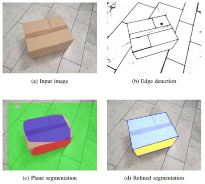

[](https://github.com/a-nau/Plane-Segmentation-Refinement/actions)

# Refined Plane Segmentation for Cuboid-Shaped Objects by Leveraging Edge Detection

The purpose of this research code is to leverage edge detection information to refine plane segmentation results as
exemplarily shown here:

<p align="center">
    
    <br>
    © 2020, IEEE.
</p>

This can for example be used to segment parcels without any need for task specific training data. See
the [paper](https://arxiv.org/abs/2003.12870) ([citation](#citation)) for more details.

## Installation

Use Python3 and `pip` to install the requirements

```shell
pip install -r requirements.txt
```

## Usage

The project can be run with

```shell
python run_refinement.py --dir_data ./input/0_dataset_027 --config ./config.yaml
```

Additionally, a test is provided in [`test_segmenation_refinement`](/tests/test_segmentation_refinement.py) that runs
the segmentation refinement for the example data. Thus, you can check the
[actions](https://github.com/a-nau/Plane-Segmentation-Refinement/actions) or try it yourself by running:

```shell
python -m unittest
```

The configuration can be set in the [`config.yaml`](./config.yaml):

- *run config*: edge detection technique and image size
- *algorihm config*: hyperparameters for clustering technqiues, etc.
- *directories*: Specification of relevant directories and files, e.g. input/output
- *visualization*: Specification which visualizations to save

If you want to perform more experiments, you can download the dataset from the
paper [here](https://url.fzi.de/dataset_planeseg).

### Folder structure

The following structure within each folder is expected (check [`0_dataset_27`](/input/0_dataset_027)):

```shell
.
├── image.png                   # base input image
├── image_contour.png           # output from DexiNed
├── 0_segmentation_final.png    # output from PlaneRCNN
├── 0_plane_masks_0.npy         # output from PlaneRCNN
└── via_region_data.json        # annotations from dataset
```

## Acknowledgements

This project uses the following works

- *PlaneRCNN: 3D Plane Detection and Reconstruction from a Single Image* ([arXiv](https://arxiv.org/abs/1812.04072),
  [Github](https://github.com/NVlabs/planercnn))
    - by Chen Liu, Kihwan Kim, Jinwei Gu, Yasutaka Furukawa, Jan Kautz
    - in IEEE Conference on Computer Vision and Pattern Recognition (CVPR), 2019
- *Dense Extreme Inception Network: Towards a Robust CNN Model for Edge Detection
  (DexiNed)* ([arXiv](https://arxiv.org/abs/1909.01955), [Github](https://github.com/xavysp/DexiNed))
    - by Xavier Soria, Edgar Riba, Angel D. Sappa
    - in IEEE Winter Conference on Applications of Computer Vision (WACV), 2020

Thank you for providing the code!

## Citation

If you use this code for scientific research, please consider citing

```latex
@inproceedings{naumannRefinedPlaneSegmentation2020,
  title = {Refined Plane Segmentation for Cuboid-Shaped Objects by Leveraging Edge Detection},
  booktitle = {{{IEEE Conference}} on {{Machine Learning}} and Applications} ({{ICMLA}})},
  author = {Naumann, Alexander and Dörr, Laura and Salscheider, Niels Ole and Furmans, Kai},
  date = {2020-12},
  location = {{Miami, USA}},
}
```

## License

This code is distributed under the 3-Clause BSD License, see [LICENSE](./LICENSE).
